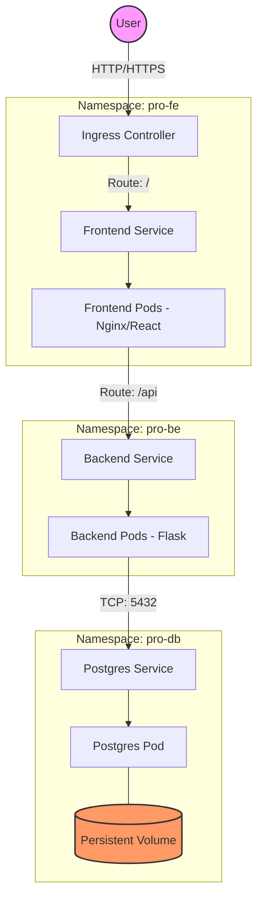
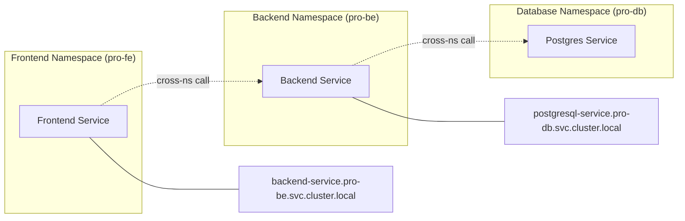

# Task Manager Helm Charts Architecture Documentation

This document provides a detailed overview of the Helm charts architecture, visual representations of the components, and explains how communication flows within the Kubernetes cluster.

---

## 🏗️ Architecture Overview

The application follows a classic **3-Tier Microservices Architecture** deployed on Kubernetes. It is designed with modularity, scalability, and security in mind, utilizing Helm for orchestration and namespace isolation for component separation.

### Key Components:
1.  **Frontend**: A React-based web application served by Nginx.
2.  **Backend**: A Python/Flask REST API that handles logic and data processing.
3.  **Database**: A PostgreSQL instance for persistent data storage.

---

## 📊 Visual Representation

### System Architecture Diagram
The following diagram illustrates the high-level architecture and the flow of traffic from the user to the database.

### Namespace Isolation & Communication
Each component resides in its own dedicated namespace, ensuring logical isolation and security. Communication between services utilizes Kubernetes Internal FQDN (Fully Qualified Domain Names).

---

## 📡 Communication Flow

### 1. External Access (User to Frontend)
-   Traffic enters the cluster through an **Ingress Controller** or via **Port Forwarding** (for development).
-   The **Frontend Service** (ClusterIP) routes requests to the **Frontend Pods**.

### 2. Frontend to Backend (API Calls)
-   The Frontend Pod runs **Nginx**, which acts as both a web server and a reverse proxy.
-   Requests starting with `/api` are proxied to the Backend service.
-   **Communication Link**: `http://backend-service.pro-be.svc.cluster.local:5000`

### 3. Backend to Database (Data Persistence)
-   The Backend Pod (Flask) connects to the database using the PostgreSQL service FQDN.
-   Authentication credentials and host information are injected via **Secrets** and **ConfigMaps**.
-   **Communication Link**: `postgresql-service.pro-db.svc.cluster.local:5432`

---

## 🛠️ Component Details

### 🖥️ Frontend Chart (`pro-fe`)
-   **Deployment**: Runs 2 replicas (default) of the Nginx/React image.
-   **ConfigMap**: Contains the custom `nginx.conf` for reverse proxying logic.
-   **Service**: A `ClusterIP` exposing port 80.
-   **Resilience**: 
    -   **HPA**: Scales pods based on CPU/Memory utilization.
    -   **PDB**: Ensures at least 1 pod is always available during disruptions.

### ⚙️ Backend Chart (`pro-be`)
-   **Deployment**: Runs 2 replicas (default) of the Flask API.
-   **ConfigMap**: Environment variables for API version, log levels, and database connection strings.
-   **Secret**: Stores sensitive database credentials (`db_user`, `db_password`).
-   **Service**: A `ClusterIP` exposing port 5000.
-   **Resilience**: 
    -   **HPA**: Dynamic horizontal scaling.
    -   **PDB**: High availability during maintenance.

### 💾 PostgreSQL Chart (`pro-db`)
-   **Deployment**: Single replica for consistency (standard for non-clustered DB).
-   **Storage**: 
    -   **PersistentVolume (PV)**: 10Gi manual storage allocation.
    -   **PersistentVolumeClaim (PVC)**: Requests storage from the PV.
-   **Security**: Secret-based credentials management.
-   **Service**: `ClusterIP` on port 5432.

---

## 📈 Reliability & Scaling

The architecture incorporates several Kubernetes best practices for production readiness:

| Feature | Implementation | Purpose |
| :--- | :--- | :--- |
| **Scaling** | Horizontal Pod Autoscaler (HPA) | Automatically adjusts the number of pods based on resource load. |
| **Availability** | Pod Disruption Budget (PDB) | Guarantees a minimum number of available replicas during node drains. |
| **Persistence** | PV & PVC | Ensures data survives pod restarts and rescheduling. |
| **Isolation** | Namespaces | Logical separation of concerns and simplified resource management. |
| **Security** | Non-Root Execution | Pods are configured with `runAsNonRoot: true` to adhere to security standards. |
| **Resource Management** | Requests & Limits | Prevents noisy neighbors and ensures predictable performance. |
