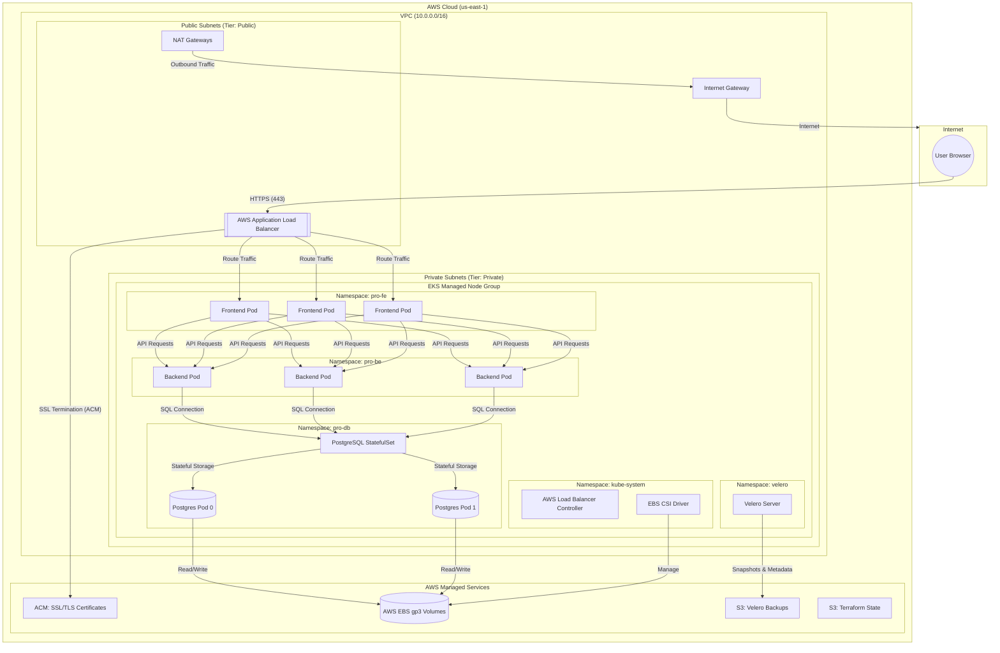

# Cloud Architecture: EKS Migration

This document visualizes the production-grade architecture built on AWS EKS. It highlights the networking, storage, security, and backup strategies implemented during the migration.

## 🏗️ Architecture Diagram

---

## 🛠️ Components Breakdown

### 1. Networking (VPC)
*   **Multi-AZ Deployment**: Resources are spread across `us-east-1a`, `us-east-1b`, and `us-east-1c` for high availability.
*   **Subnet Isolation**: 
    *   **Public**: Hosts the Application Load Balancer (ALB) and NAT Gateways.
    *   **Private**: Hosts the EKS Worker Nodes. Workloads are not directly reachable from the internet, increasing security.

### 2. Compute (EKS)
*   **Control Plane**: Managed by AWS (v1.30).
*   **Data Plane**: Managed Node Group (`general`) using `t3.medium` instances with auto-scaling (min: 1, max: 3).

### 3. Traffic Management (Ingress)
*   **AWS Load Balancer Controller**: Provisions an Application Load Balancer (ALB) dynamically based on Kubernetes Ingress resources.
*   **Security (SSL/TLS)**: SSL termination is handled at the ALB using **AWS Certificate Manager (ACM)**.
*   **HTTPS Redirect**: All port 80 (HTTP) traffic is automatically redirected to port 443 (HTTPS).

### 4. Database & Storage (StatefulSet)
*   **StatefulSet**: PostgreSQL runs with 2 replicas, ensuring stable network identities and persistent storage binding.
*   **Dynamic Provisioning**: Using the **EBS CSI Driver**, Kubernetes automatically requests and attaches **gp3 EBS volumes** to database pods.

### 5. Disaster Recovery (Velero)
*   **Cloud-Native Backups**: Velero is installed to perform scheduled backups of all Kubernetes resources and EBS snapshots.
*   **Off-site Storage**: Backups are stored in a dedicated **S3 bucket** (`kenzy-velero-backups`), protecting data even if the cluster is deleted.

### 6. Security (IAM & OIDC)
*   **OIDC Provider**: Integrated with EKS to enable **IAM Roles for Service Accounts (IRSA)**.
*   **Least Privilege**: The ALB Controller and Velero have specific IAM roles that grant them only the AWS permissions they need.
